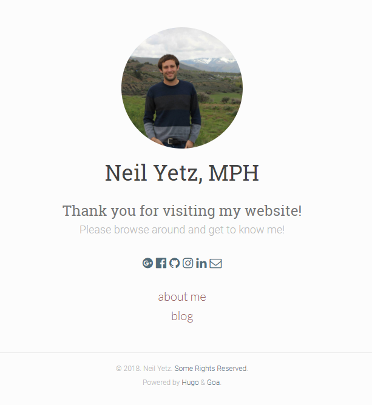

# Personal Website

This is a work in progress. I am creating it using [Hugo](https://gohugo.io/). Hugo is quite fun to build [static websites](https://en.wikipedia.org/wiki/Static_web_page) as there are already built themes for you to build your website around. Additionally, unlike SquareSpace or Wix, Hugo is **COMPLETELY FREE** and extremely fast. Hugo website builder requires a combination of the "Go" programming language and simple Markdown Syntax. Learn those two languages (and well, knowing Git helps for free server hosting) and you are golden.  When my website is complete, I will likely add it to my email signature. The current plan is to eventually fill it with my CV, resume, information about me, hobbies and potentially a blog detailing important things I learn throughout the course of my PhD program. As of now, I still trying to understand how the Hugo website developer works. But, when I have created a website I am satisfied with, I will host it through the Github website server. I am excited! 

**Preview**

Here is a preview of my current draft:

For now, I am using the [Goa](https://themes.gohugo.io/hugo-goa/) theme. I like it because it is basic and is all-around practical. All credit for the theme is to [shenyobar](https://github.com/shenoybr) and the theme is available for download at the [Hugo-Goa repository](https://github.com/shenoybr/hugo-goa).
